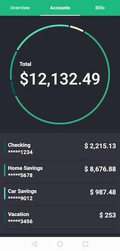

# AndroidX Jetpack Compose Example

Based on [Material Rally app](https://material.io/design/material-studies/rally.html)

This demo app uses kotlin and `androidx.*` published version `0.1.0-dev01`.

### Prerequisites
Install [Android Studio Preview](https://developer.android.com/studio/preview)

#### Resources
- [androidx-master-dev with repo tool](https://android.googlesource.com/platform/frameworks/support/+/androidx-master-dev/README.md)
- [Jetpack Compose](https://developer.android.com/jetpack/compose)
- [androidx-master-dev/ui/ui-material](https://android.googlesource.com/platform/frameworks/support/+/refs/heads/androidx-master-dev/ui/ui-material/integration-tests/)
- https://github.com/Foso/Jetpack-Compose-Playground
